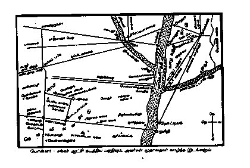

# Scan 16 — map plate

## Pass 1 notes

- the physical page is a landscape-oriented cartographic plate printed sideways in the source;
- per archival decision, the map is preserved **as a picture rather than transcribed label-by-label into Unicode text**;
- the image asset is a direct source-pixel capture of scan16 and preserves the caption, roads/radial lines, rivers, settlement points, shrine/locality labels, compass and other cartographic detail together;
- no map label is modernized, normalized, inferred from external geography or separately reconstructed in text;
- the earlier dense-cartographic-label reread hold is **retired / not applicable** because the canonical representation for this page is the source image itself;
- status and visual fidelity remain needs-review for later visual verification.

<!-- மூல மொத்த ஸ்கேன் பக்கம்: 16; பகுதி: 001; பகுதி உள்ளூர் பக்கம்: 16; அச்சுப் பக்கம்: —; PASS 1 COMPLETE / IMAGE-MAP CAPTURE / needs-review -->

## Formal Part001 Pass 2A review

- direct source-image identity and physical page-boundary comparison completed against scan16;
- canonical image asset linkage confirmed: `../assets/scan-0016-map.png`;
- the asset preserves the cartographic plate and caption in a normalized readable orientation; no label-by-label Unicode transcription is required;
- source-text corrections: **0 / not applicable to image-map representation**;
- unresolved textual questions: **0**;
- Pass 2A result: **REVIEWED / PASS**;
- page remains `status: "needs-review"` / `visual_fidelity: "needs-review"` pending later gates.

## Formal Part001 Pass 2B review

- independent Pass 2B review completed directly against the rendered scan16 source image;
- canonical representation remains the preserved image-map record linked as `../assets/scan-0016-map.png`;
- page identity, sideways landscape cartographic plate, caption-bearing layout and image-record treatment were rechecked;
- per archival rule, no map label was recreated, modernized, normalized or verified label-by-label as Unicode text;
- source-text corrections in Pass 2B: **0 / not applicable to image-map representation**;
- unresolved textual questions: **0**;
- Pass 2B result: **REVIEWED / PASS**;
- page remains `status: "needs-review"` / `visual_fidelity: "needs-review"` pending later gates.

## Formal Part001 Pass 3 review

- meaningful full-page visual / structural verification completed directly against rendered source pixels;
- source page is a sideways landscape cartographic plate contained within a strong rectangular border;
- map extent, river/road network, settlement points, compass and caption area are preserved as one visual object; no ordinary printed page number is assigned;
- maintained image asset `works/ponnar-sankar/assets/scan-0016-map.png` exists in live main and remains the canonical representation for this page;
- map treatment is verified visually as image-preserved evidence; labels were not reconstructed or checked label-by-label as Unicode;
- structural corrections in Pass 3: **0**;
- unresolved visual / structural questions: **0**;
- Pass 3 result: **REVIEWED / PASS**;
- page remains `status: "needs-review"` / `visual_fidelity: "needs-review"` pending whole-Part audit and final metadata promotion.
